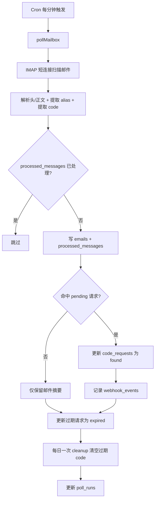

# Mail Code Worker (Cloudflare Workers + D1)

Cloudflare Workers 验证码接收后台：
- 每分钟 Cron 触发 IMAP 轮询（短连接）
- 按 alias 邮箱分类提取验证码
- 全量状态落 D1（不使用 KV）
- 管理 API 全部 Bearer Token 保护
- 内置用户前端页面（`/`），用户可直接填写邮箱接码

> 你当前要求已实现：验证码任务默认 1 小时过期，过期 code 每天只清理一次。

## 部署文档导航

- 后端部署（Workers + D1）：[BACKEND_DEPLOY.md](./BACKEND_DEPLOY.md)
- 前端部署（Pages + Functions 代理）：[FRONTEND_DEPLOY.md](./FRONTEND_DEPLOY.md)

## 目录结构

```txt
worker-mail-code/
  package.json
  tsconfig.json
  wrangler.toml
  schema.sql
  src/
    constants.ts
    types.ts
    index.ts
    routes/
      api.ts
      web.ts
    services/
      poll.ts
      imap-client.ts
      mail-parser.ts
      code-extractor.ts
      cleanup.ts
      events.ts
      public-security.ts
    utils/
      common.ts
      http.ts
  pages-client/
    index.html
    _headers
    assets/
      app.js
      style.css
    functions/
      api/
        [[path]].js
  README.md
```

## 代码拆分说明

- `src/index.ts`：Worker 入口（`fetch`/`scheduled`），只做调度与兜底异常。
- `src/routes/api.ts`：HTTP 路由和参数校验，不放复杂业务。
- `src/routes/web.ts`：用户接码前端页面（单页，无前端框架依赖）。
- `src/services/poll.ts`：IMAP 轮询主流程（抓取、去重、落库、命中请求）。
- `src/services/imap-client.ts`：Worker 兼容的 IMAP 短连接与命令读写。
- `src/services/mail-parser.ts`：邮件解析与 alias 提取优先级逻辑。
- `src/services/code-extractor.ts`：验证码提取规则（关键词优先 + 兜底）。
- `src/services/cleanup.ts`：每日一次清理过期验证码。
- `src/services/events.ts`：统一事件写入 `webhook_events`。
- `src/services/public-security.ts`：公开接口的访问令牌与限流逻辑。
- `src/utils/common.ts`：通用工具函数（时间、字符串、环境变量、哈希等）。
- `src/utils/http.ts`：鉴权、CORS、JSON 响应封装。

## 编码与乱码规避

- 源码文件统一使用 `UTF-8` 编码。
- 注释使用中文，但接口字段、数据库字段、日志事件名保持英文 ASCII，避免跨系统乱码。
- HTTP 响应统一 `content-type: application/json; charset=utf-8`。

## 1) 安装依赖

```bash
npm install
```

## 2) 创建 D1

```bash
npx wrangler d1 create mail-code-db
```

把返回的 `database_id` 填进 `wrangler.toml`：

```toml
[[d1_databases]]
binding = "DB"
database_name = "mail-code-db"
database_id = "替换为实际 database_id"
```

## 3) 初始化表结构

远程环境：

```bash
npx wrangler d1 execute mail-code-db --remote --file=./schema.sql
```

本地环境：

```bash
npx wrangler d1 execute mail-code-db --local --file=./schema.sql
```

如果你已经部署过旧版本，请执行迁移 SQL（新增公开访问控制与限流表）：

```sql
CREATE TABLE IF NOT EXISTS public_request_access (
  id INTEGER PRIMARY KEY AUTOINCREMENT,
  request_id TEXT UNIQUE NOT NULL,
  token_hash TEXT NOT NULL,
  expires_at TEXT NOT NULL,
  created_at TEXT NOT NULL
);

CREATE TABLE IF NOT EXISTS rate_limits (
  id INTEGER PRIMARY KEY AUTOINCREMENT,
  bucket_key TEXT NOT NULL,
  window_start TEXT NOT NULL,
  count INTEGER NOT NULL DEFAULT 0,
  created_at TEXT NOT NULL,
  updated_at TEXT NOT NULL,
  UNIQUE(bucket_key, window_start)
);
```

## 4) 配置 Secrets / Vars

必填 secrets：

```bash
npx wrangler secret put IMAP_HOST
npx wrangler secret put IMAP_PORT
npx wrangler secret put IMAP_USER
npx wrangler secret put IMAP_PASS
npx wrangler secret put ADMIN_TOKEN
```

可选 secrets：

```bash
npx wrangler secret put ALLOWED_ORIGIN
npx wrangler secret put WEBHOOK_SECRET
```

`wrangler.toml` 里已包含默认 vars：
- `POLL_LOOKBACK_MINUTES = "10"`
- `MAX_EMAILS_PER_POLL = "20"`
- `AUTO_CREATE_ALIAS = "true"`
- `STORE_BODY = "false"`
- `CODE_EXPIRE_SECONDS = "3600"`
- `PUBLIC_APP_ENABLED = "true"`
- `PUBLIC_CREATE_LIMIT_PER_10M = "10"`
- `ALLOWED_ORIGINS = ""`（可填多个域名，逗号分隔）

## 5) 本地运行

```bash
npm run dev
```

## 6) 部署

```bash
npm run deploy
```

## 7) 部署到 Cloudflare Pages（前端）

前端模板目录：

```txt
pages-client/
```

操作步骤：
1. 在 Cloudflare Pages 新建项目，直接上传 `pages-client` 目录。
2. 在 Pages 项目变量中新增：
   - `BACKEND_ORIGIN=https://你的-worker域名`（例如 `https://mail-code-worker.xxx.workers.dev`）
3. 确保 `pages-client/functions/api/[[path]].js` 已随代码发布（这是同域代理层）。
4. 重新部署 Pages。

注意：
- 前端用户无需填写后端地址，页面只调用同域 `/api/*`。
- 真实 Worker 地址只在 Pages 变量 `BACKEND_ORIGIN` 中保存，不暴露在前端源码里。
- `pages-client/_headers` 已附带安全响应头模板，`connect-src` 仅允许 `'self'`。

## 8) 用户前端页面

部署后直接访问：

```txt
https://<your-pages-domain>/
```

页面会调用公开接口：
- `POST /api/public/requests`
- `GET /api/public/requests/:requestId`（`x-access-token` 请求头）
- `GET /api/public/connection-test`（连接测试）

公开接口安全机制：
- 不使用 `ADMIN_TOKEN`
- 每个请求返回一次性 `accessToken`（仅该 requestId 可查询）
- token 在 D1 中只保存哈希值，不保存明文
- 创建任务按 IP 限流（默认 10 次 / 10 分钟）

## 9) API 用法

除 `/api/public/*` 外，其他 `/api/*` 需要：

```http
Authorization: Bearer <ADMIN_TOKEN>
```

### 创建接码任务

```bash
curl -X POST 'https://<your-worker>/api/requests' \
  -H 'Authorization: Bearer <ADMIN_TOKEN>' \
  -H 'Content-Type: application/json' \
  -d '{"aliasEmail":"main_openai@2925.com","ttlSeconds":3600}'
```

### 查询任务

```bash
curl 'https://<your-worker>/api/requests/req_xxx' \
  -H 'Authorization: Bearer <ADMIN_TOKEN>'
```

### 查询 alias 最新状态

```bash
curl 'https://<your-worker>/api/aliases/main_openai%402925.com/latest' \
  -H 'Authorization: Bearer <ADMIN_TOKEN>'
```

### 最近邮件摘要

```bash
curl 'https://<your-worker>/api/emails/recent?limit=20' \
  -H 'Authorization: Bearer <ADMIN_TOKEN>'
```

### 手动触发轮询

```bash
curl -X POST 'https://<your-worker>/api/poll-now' \
  -H 'Authorization: Bearer <ADMIN_TOKEN>'
```

### 手动清理过期 code

```bash
curl -X POST 'https://<your-worker>/api/cleanup' \
  -H 'Authorization: Bearer <ADMIN_TOKEN>'
```

### 健康检查

```bash
curl 'https://<your-worker>/health'
```

### 公开接口：创建任务（前端调用）

```bash
curl -X POST 'https://<your-worker>/api/public/requests' \
  -H 'Content-Type: application/json' \
  -d '{"aliasEmail":"main_openai@2925.com"}'
```

### 公开接口：查询任务（前端调用）

```bash
curl 'https://<your-worker>/api/public/requests/req_xxx' \
  -H 'x-access-token: token_xxx'
```

## 10) Cron

`wrangler.toml` 已设置每分钟运行：

```toml
[triggers]
crons = ["* * * * *"]
```

Worker 每次 Cron 会：
1. 插入 `poll_runs` 开始记录
2. IMAP 登录 + 扫描近 N 分钟邮件
3. 去重后写 `emails` 与 `processed_messages`
4. 命中 `pending` 请求则更新 `found`
5. 过期 `pending` 更新为 `expired`
6. 每天只跑一次 `cleanup`（清空已过期任务中的 `code` 字段）
7. 更新 `poll_runs` 结束状态

## 11) 流程图



## 12) 安全注意事项

- 所有管理接口必须使用 `ADMIN_TOKEN`。
- 用户页面走公开接口，不会暴露 `ADMIN_TOKEN` 到浏览器。
- 公开查询必须携带每任务独立 `accessToken`。
- token 仅哈希入库，泄露数据库也无法直接反查明文 token。
- 公开创建接口有 IP 限流，降低批量滥用风险。
- 生产必须配置 `ALLOWED_ORIGIN`，避免宽松 CORS。
- 不要在日志输出邮箱密码、验证码明文、完整敏感正文。
- 建议保持 `STORE_BODY=false`，默认只存摘要。
- 使用参数化 SQL（本项目已实现）避免注入。
- 仅连接你授权的邮箱账号，不做未授权读取。

## 13) IMAP 兼容性说明（重要）

Cloudflare Worker 侧 IMAP（TCP socket）在不同服务商上兼容性可能有差异，尤其是复杂 MIME / 特殊 IMAP 扩展。

推荐兜底方案：

A. **IMAP 轮询放在 VPS/Node 服务**（可用 imapflow），Worker + D1 只做 API 与存储。  
B. **如果使用自有域名**，可用 Cloudflare Email Routing + Email Worker，收到邮件后直接入 D1（通常最稳）。

## 14) 服务商适配点

这些位置可能需要按邮箱服务商调整：
- IMAP 搜索条件（`UID SEARCH SINCE ...`）
- `UID FETCH` 字段（某些服务商头字段命名差异）
- alias 提取优先级（`Delivered-To` / `X-Original-To` / `Envelope-To`）
- 特定验证码模板 regex

